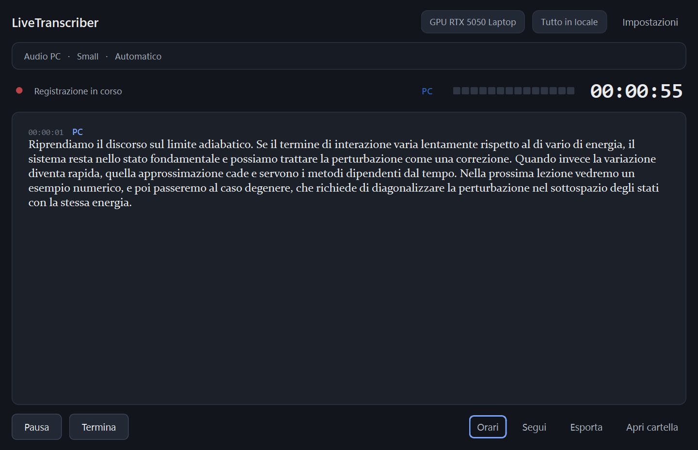

# LiveTranscriber

[](https://github.com/LorenzoLubrano/LiveTranscriber/actions/workflows/tests.yml)

Real-time transcription of anything your PC plays, and of your microphone, on
Windows 10/11. Lectures, meetings, videos, calls.

Everything runs **on your machine**. No cloud speech-to-text, no API keys, no
account, no telemetry. After the first model download the app works with the
network switched off.



<sub>A real recording, captured from the running app: Windows' speech
synthesiser reading a physics passage through the speakers, transcribed live
through WASAPI loopback. Light theme: [screenshot-light.png](docs/screenshot-light.png)</sub>

---

## Download

**`LiveTranscriber-1.1.1-windows-x64.zip`** — 128 MB, from the
[latest release](https://github.com/LorenzoLubrano/LiveTranscriber/releases/latest).
One download for every PC. Unzip anywhere and run `LiveTranscriber.exe`: nothing
is installed, no Python, no CUDA Toolkit, no Visual C++ redistributable.

**With an NVIDIA card**, open *Impostazioni → Elaborazione* and press **Attiva la
GPU**. The app fetches NVIDIA's cuBLAS libraries (527 MB), checks them against a
checksum built into this release, and uses the GPU from then on — several times
faster, and offline again once it is done. There is a pre-packaged
`-nvidia.zip` too, for machines that will not be online.

Whisper models are not bundled either. The app downloads the one you choose on
first use (75 MB–3 GB), once.

If the window does not open, run `LiveTranscriber.exe --selftest`: it checks the
audio devices, the voice detection, the model and the speed of your PC, writes a
report to `%LOCALAPPDATA%\LiveTranscriber\diagnostica.txt` and shows it.

---

## What it does

It opens on a home page — a greeting, and the two things there are to do here:
live transcription, or settings. The window above is what *Trascrizione dal
vivo* opens.

- **Audio PC** — records what Windows is playing, through WASAPI loopback. It
  taps the audio stream itself, so there is no room noise and no need to point a
  microphone at your speakers. Works with speakers, headphones and Bluetooth.
- **Microphone** — records the input device you choose.
- **PC + microphone together** — both at once, kept separate in the transcript:

  ```text
  00:13:42

  [PC]  Il sistema può essere descritto attraverso questa Hamiltoniana...
  [MIC] Quindi in questo caso siamo nel limite adiabatico?
  [PC]  Esatto, purché la variazione sia sufficientemente lenta...
  ```

  No speaker-identification AI is involved: the app already knows which stream
  each piece of audio arrived on.

## Requirements

| | |
|---|---|
| OS | Windows 10 or 11 (64-bit) — WASAPI loopback is Windows-only |
| RAM | 8 GB minimum, 16 GB recommended |
| Disk | ~2 GB for the app, plus 75 MB–3 GB per Whisper model |
| GPU | Optional, NVIDIA only. See [Speed](#speed-will-it-work-on-my-pc) |
| CPU | AVX2 recommended (any CPU from 2013 on). Without it, expect Tiny only |
| Python | 3.13 (developers only — end users get a build with Python included) |

## Speed: will it work on my PC?

Transcribing **live** is much harder than transcribing a recording. The app
re-transcribes a growing buffer so it can correct itself before showing you
anything, which means every second of audio passes through Whisper four or five
times. A model that handles a lecture recording faster than real time can still
fall behind when it has to keep up with one.

So the app measures *your* machine instead of guessing. It transcribes a short
synthesised sentence through the real pipeline and reports how much margin you
have. You can run it any time from **Impostazioni → Velocità**, and the app
offers it once after your first model download.

Measured on the development machine (Ryzen 7 260, six physical cores, and an
RTX 5050 laptop GPU), as seconds of computation per second of audio — **lower is
better, and 1.0 means it cannot keep up**. Medians of repeated runs:

| Model | CPU (int8) | NVIDIA GPU (float16) |
|---|---|---|
| Tiny | 0.18 — comfortable | 0.07 |
| Base | 0.55 — works | — |
| Small | **0.97 — cannot keep up** | 0.13 — comfortable |
| Turbo | 1.38 | 0.20 — comfortable |
| Medium | 1.82 | 0.45 |
| Large-v3 | 1.81 | 0.36 |

Two things in that table are worth knowing. `small` is excellent on this GPU and
unusable on the same machine's CPU, where it produces text with roughly 20–30
seconds of delay — no spec sheet would have told you that. And **Turbo costs
less than half of Medium** while being close to Large-v3 in accuracy, which is
the opposite of what this project assumed before measuring it.

Recording the PC and the microphone at once doubles the cost, because both
streams are transcribed independently.

A short measurement is taken at whatever clock speed your CPU happens to be
boosting to, and a laptop will not hold that for an hour of lecture. So the app
leaves a margin when it picks a model for you, and watches the real load while
recording.

If a model turns out to be too heavy while you are recording, the app says so,
automatically reduces how often it transcribes, and keeps recording the audio
either way — it never swaps the model mid-recording behind your back.

### Where the NVIDIA libraries come from

Transcription runs on [CTranslate2](https://github.com/OpenNMT/CTranslate2), and
on the GPU it needs **cuBLAS** — 736 MB of NVIDIA libraries, which is why they
are not in the main download. It does **not** need the CUDA Toolkit, and it does
not need cuDNN either: listing the libraries actually mapped during GPU
transcription, across three model architectures with real speech, gives
`cublasLt64_12.dll`, `cublas64_12.dll`, and a 300 KB `cudnn64_9.dll` that
CTranslate2 already ships inside its own package. The 1 GB cuDNN wheel is never
touched.

The pack the app downloads is NVIDIA's own `nvidia-cublas-cu12` wheel content,
unmodified, published as a
[separate release](https://github.com/LorenzoLubrano/LiveTranscriber/releases/tag/cuda-runtime-12.9).
Its SHA-256 is pinned in the source, so only the exact archive a build was made
against is ever unpacked, and the entry paths are checked before extraction.

### What about AMD and Intel graphics?

They are not used, and the app will not pretend otherwise. Transcription runs on
[CTranslate2](https://github.com/OpenNMT/CTranslate2), which supports CPU and
NVIDIA CUDA only — there is no ROCm, DirectML or oneAPI backend. On an AMD or
Intel machine the CPU path is the whole story, and `tiny` or `base` is the
realistic choice for live use.

## Install (developers)

```powershell
git clone https://github.com/LorenzoLubrano/LiveTranscriber.git
cd LiveTranscriber

py -3.13 -m venv .venv
.\.venv\Scripts\Activate.ps1

pip install -e ".[dev]"
```

### CPU mode

Works everywhere, no extra steps. Transcription runs with `int8` quantisation
across your CPU cores.

### NVIDIA GPU mode

```powershell
pip install -e ".[gpu]"
```

This installs the CUDA runtime libraries (cuBLAS and cuDNN, ~1.5 GB) as Python
packages, so **you do not need to install the CUDA Toolkit**.

If CUDA is missing or misconfigured the app does not crash — it logs the problem
and falls back to CPU.

#### RTX 50-series (Blackwell) note

Blackwell GPUs (compute capability sm_120) need **CTranslate2 ≥ 4.8.2** and a
**CUDA 12.8+** runtime, and only `float16` works — CTranslate2 disables INT8 on
sm_120 (release 4.6.2). The app detects this and chooses the right compute type
on its own; forcing `int8` on such a GPU would fail with
`CUBLAS_STATUS_NOT_SUPPORTED`.

### Building the releases

```powershell
pip install -e ".[build]"
.\scripts\build_windows.ps1 -Clean -Package            # the any-PC build
.\scripts\build_windows.ps1 -Gpu -Clean -Package       # the NVIDIA build
```

Each writes a portable folder and a `.zip` into `dist\`. The two builds go to
different folder names on purpose, so building one can never overwrite a copy of
the other that someone is using. A one-folder build rather than a single .exe is
also deliberate: one-file builds unpack to `%TEMP%` on every launch, which is
slow, breaks native DLL loading for Qt and CTranslate2, and would make the LGPL
relinking requirement much harder to satisfy.

## Checking your audio setup

Before anything else, confirm Windows is giving us what we need:

```powershell
python scripts/audio_test.py --list        # show every device
python scripts/audio_test.py --both        # record 10 s of PC audio + mic
```

The second command writes `pc_audio.wav`, `microphone.wav` and `mixed.wav` to
`scripts/out/` and reports whether each stream carried real signal. Play
something on your PC while it runs.

## Tests

```powershell
pytest                                  # everything
pytest -m "not hardware"                # skip tests needing a sound device
pytest tests/test_capture_hardware.py -v # real capture, end to end
```

The hardware tests are self-contained: they play a 440 Hz tone through your
default output and assert that WASAPI loopback returns that exact frequency, so
they need no audio playing and no human.

## Where your data lives

```text
%LOCALAPPDATA%\LiveTranscriber\
    models\                      Whisper models
    logs\live-transcriber.log    Rotating technical log
    config.json                  Settings
    cache\

%USERPROFILE%\Documents\LiveTranscriber\Recordings\
    2026-09-18_14-30_Lezione_QCED\
        pc_audio.wav  microphone.wav  mixed.wav
        transcript.txt  transcript.srt  transcript.vtt
        session.json
```

Recordings are never overwritten: a session whose name already exists gets a
numeric suffix.

## Privacy

LiveTranscriber processes audio and transcripts **locally on your device**. No
audio is sent to any external server for transcription.

- No telemetry, no analytics, no account.
- The only network access the app ever makes is downloading a Whisper model
  from Hugging Face, once, when you ask for it.
- The technical log records timings and sizes, never transcript text.

## Troubleshooting

### "Nessun dispositivo di riproduzione disponibile"

Windows exposes a loopback device only for endpoints that exist. Connect
speakers or headphones, or enable a device in *Sound settings → Output*.

### PC audio records silence

- Check you picked the output device Windows is actually playing through — the
  one marked *(predefinito)* is the system default.
- Some apps take exclusive control of the audio device. Turn off *Allow
  applications to take exclusive control* in the device's advanced properties.

### The microphone records silence

Check *Settings → Privacy & security → Microphone* and confirm desktop apps are
allowed to access it. Also check the device is not muted in the Windows volume
mixer.

### Bluetooth headphones sound bad while recording

Windows switches a Bluetooth headset into its low-quality "hands-free" profile
when an app opens its microphone. Record PC audio through loopback only, or use
a separate microphone, to keep the headphones in high-quality playback mode.

### Device names look truncated

Only via the legacy MME host API, which cuts names at 31 characters and
misreports sample rates. LiveTranscriber enumerates through WASAPI precisely to
avoid this.

More detail in [docs/TROUBLESHOOTING.md](docs/TROUBLESHOOTING.md) and
[docs/ARCHITECTURE.md](docs/ARCHITECTURE.md).

## In italiano

L'interfaccia dell'app è in italiano; questo README è in inglese perché il
progetto è pubblico. In breve:

- **Quale versione scaricare.** Se non hai una scheda grafica NVIDIA, prendi
  `LiveTranscriber-1.1.1-windows-x64.zip`. Se ce l'hai, prendi quella con
  `-nvidia`: fa la stessa cosa diverse volte più veloce.
- **Come si installa.** Non si installa: scompatti la cartella dove vuoi e apri
  `LiveTranscriber.exe`.
- **Come si usa.** All'apertura c'è una pagina iniziale con due scelte:
  *Trascrizione dal vivo* e *Impostazioni*. Dalla trascrizione si torna indietro
  con *← Home*, che resta bloccato finché una registrazione è in corso.
- **Serve internet?** Solo la prima volta, per scaricare il modello che scegli.
  Dopo funziona con la rete staccata.
- **Quale modello scegliere.** Lascia fare all'app: alla prima esecuzione ti
  propone di misurare la velocità del tuo PC e sceglie di conseguenza. Puoi
  ripetere la misura da *Impostazioni → Velocità*.
- **Se qualcosa non parte.** Apri il Prompt dei comandi nella cartella e lancia
  `LiveTranscriber.exe --selftest`: ti dice cosa non funziona e scrive un
  rapporto in `%LOCALAPPDATA%\LiveTranscriber\diagnostica.txt`.
- **Privacy.** LiveTranscriber elabora audio e trascrizioni localmente sul
  dispositivo. Nessun audio viene inviato a server esterni per la trascrizione.

## License

MIT — see [LICENSE](LICENSE). Third-party components and their licenses are
listed in [THIRD_PARTY_LICENSES.md](THIRD_PARTY_LICENSES.md).
